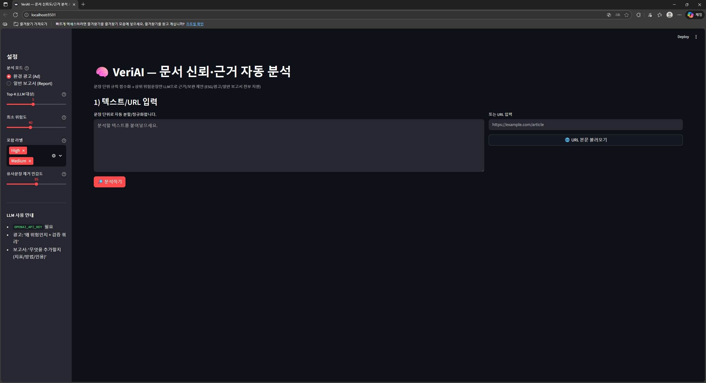
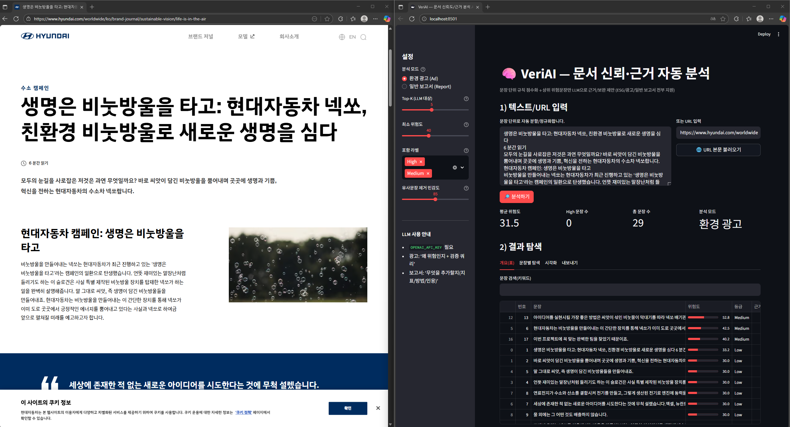
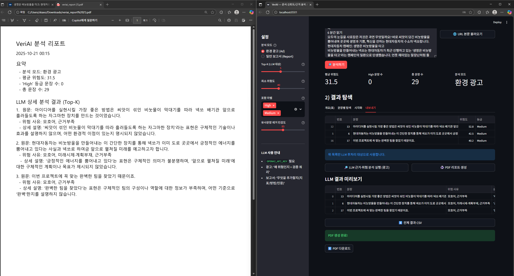

# VeriAI 🧠🌿  
문서 신뢰도 & ESG·그린워싱 위험도 분석 도구

> 환경 광고/ESG 문서/일반 보고서를 문장 단위로 분석해 **근거 부족·모호한 표현·범위 과장** 등을 점수화하고, 상위 위험 문장만 LLM으로 심층 분석해 리포트까지 만들어 주는 도구입니다.

---

## 🔎 프로젝트 개요 (Overview)

**VeriAI**는 다음과 같은 워크플로우로 동작합니다.

1. 사용자가 텍스트를 붙여넣거나, URL을 입력하면 본문을 추출합니다.
2. 미리 정의된 규칙(`config/ad_rules.json`, `config/report_rules.json`)에 따라  
   각 문장의 **증거성, 모호성, 범위, 시점, 언어적 위험, 오프셋 의존도** 등을 정량화합니다.
3. 문장별로 0–100 사이의 **위험도 점수 risk**와 **등급 High/Medium/Low**를 부여합니다.
4. 위험도가 높은 상위 K개 문장을 골라 OpenAI LLM에 보내,  
   - 환경 광고 모드: 왜 그린워싱 위험이 있는지, 어떤 근거가 추가되어야 하는지  
   - 일반 보고서 모드: 어떤 수치/방법/표/인용이 부족한지  
   를 JSON 형태로 받아옵니다.
5. 전체 결과를 **대시보드 Streamlit**로 탐색하고,  
   **CSV / PDF 리포트**로 내보낼 수 있습니다.

---

## 🌍 Project Overview (Overview - EN)

**VeriAI** is an AI-assisted document checker for:

- ESG / environmental advertisements (greenwashing risk)
- General business / technical reports (evidence & clarity)

It:

- Splits documents into sentences
- Scores each sentence with rule-based features
- Sends only the riskiest ones to an LLM for deeper review
- Provides interactive visualizations and exports (CSV, PDF)

---

## 🏅 수상 및 성과 (Achievements)

- 🏆 2025 캡스톤 디자인 경진대회 **우수상 수상**
- 🏆 2025 캡스톤 디자인 경진대회 **ESG 우수상 수상**
- 🌎 일본 학술교류회 **프로젝트 발표 선정**

> 해당 프로젝트는 실무·학술적으로 모두 인정받은 검증된 프로젝트입니다.

---

## ✨ 주요 기능 (Features)

- **📥 입력**
  - 텍스트 직접 입력
  - URL 입력 → `trafilatura`로 본문 자동 추출
- **⚖️ 규칙 기반 정량 분석**
  - 수치·연도·표준·제3자 검증 등 **근거 점수(evidence_score)**
  - 모호어/과장/미래시제 등 **모호성 점수(vagueness_score)**
  - 적용 범위/시점/오프셋 사용에 따른 위험도
  - 0–100 위험도(risk) + High/Medium/Low 라벨 부여
- **🧾 두 가지 분석 모드**
  - `환경 광고 (Ad)` : ESG·그린워싱 중심 규칙
  - `일반 보고서 (Report)` : 연구/기술/비즈니스 보고서용 증거성 규칙
- **🧠 LLM 심층 분석**
  - 상위 위험 문장 K개만 LLM에 전달
  - 광고 모드: `risk_reasons`, `explanation`, `evidence_needed`, `suggested_queries` 등
  - 보고서 모드: `issues`, `what_to_add(metrics/method/tables_figures/citations)` 등
- **📊 시각화 & XAI**
  - 문장별 위험도 스캐터 플롯
  - 위험 요인 Stacked Bar 차트
  - SHAP Waterfall Plot으로 **점수가 어떻게 만들어졌는지** 설명
- **📤 내보내기**
  - 전체 결과 CSV 다운로드
  - 요약 + LLM 결과를 포함한 PDF 리포트 생성

---

## 📸 스크린샷 (Screenshots)

### 메인 화면


### 분석 결과 화면


### PDF 리포트 예시


---

## 🧱 시스템 아키텍처 (Architecture)

VeriAI는 **규칙 기반 위험도 분석 + LLM 심층 분석**을 결합한 하이브리드 구조로 동작합니다.

User Input (Text / URL)

│
▼
**parsers.py**  
- URL 입력 시 본문 크롤링 및 불필요 텍스트 제거  
│  
▼  
**rules.py**  
- 문장 분리  
- 규칙 기반 Feature 추출  
  (evidence, vagueness, coverage, temporal 등)  
- 0–100 위험도(risk) 계산  
│  
▼  
**llm.py**  
- 위험 상위 K개 문장을 선별하여 LLM 요청  
- 광고/보고서 모드에 맞는 JSON 심층 분석 결과 생성  
│  
▼  
**report.py**  
- LLM + 규칙 기반 결과 요약  
- PDF/CSV 리포트 생성  
│  
▼  
**app.py** (Streamlit UI)  
- 입력 → 분석 → 시각화 → 리포트 다운로드 전체 플로우 제공

### ✔️ 구성 요소 요약

- **parsers.py** — URL 본문 텍스트 크롤링(trafilatura)  
- **rules.py** — 규칙 기반 점수화(ad_rules.json, report_rules.json 사용)  
- **llm.py** — OpenAI API 호출 및 JSON 응답 처리  
- **report.py** — PDF 리포트 생성(FPDF)  
- **app.py** — Streamlit UI 및 전체 워크플로우 제어

---

## 📚 규칙 설정 파일 (Rule Configuration)

VeriAI의 규칙 기반 점수 계산은 `config` 폴더의 JSON 파일로 분리되어 있습니다.  
이 파일들을 수정하면 Python 코드를 건드리지 않고도 규칙을 쉽게 확장·조정할 수 있습니다.

- `config/ad_rules.json` — **환경 광고 / ESG 마케팅 문장용 규칙 세트**
  - 공정거래위원회의 *환경 관련 표시·광고에 관한 심사지침*에서 제시하는 표현 유형과 예시 문구를 참고해,
    모호한 친환경 표현, 과장·절대 표현, 근거 없는 환경 주장, 탄소중립/상쇄 관련 용어 등을 렉시콘(lexicon)으로 정리했습니다.
  - 주요 구성
    - `weights`: evidence, vagueness, coverage, temporal, language, offset_risk 등의 가중치
    - `thresholds`: High / Medium / Low 등급을 나누는 기준값
    - `regex`: 숫자+단위, 연도, 범위(scope), URL, 금액, 감축/증가 %, 시점 표현 등의 패턴
    - `lexicons`: vague / overclaim / future / offset_terms / greenwashing_keywords 등 핵심
      단어·구 목록

- `config/report_rules.json` — **일반 보고서 / 연구·비즈니스 문장용 규칙 세트**
  - 연구 방법, 표본, 통계 정보, 인용·참고문헌, 표·그림 언급 등 **증거성 Evidence** 관련 요소에
    집중해 설계했습니다.
  - 구조는 `ad_rules.json`과 동일하지만, 논문·보고서 도메인에 맞는 정규식(regex)과 렉시콘을
    사용합니다.
    - 예: 인용 형식([1], (Kim, 2024)), DOI, 표·그림(Figure/Table), 통계 지표(p-value, CI, n=…) 등
      탐지

이 규칙 설정 파일들을 기반으로 `rules.py`가 문장별 Feature를 추출하고,  
가중치를 적용해 0–100 사이의 최종 위험도 점수를 계산합니다.

---

## 🛠️ 기술 스택 (Tech Stack)

### 🔹 Language & Environment
- Python 3.10+
- Virtual Environment (venv)

### 🔹 Framework & UI
- **Streamlit** — 웹 UI 및 결과 시각화
- **Plotly / Matplotlib** — 그래프 및 위험도 분포 시각화
- **SHAP** — 규칙 기반 점수 기여도 시각화

### 🔹 AI / NLP
- **OpenAI API (GPT 계열)** — 고위험 문장 심층 분석
- **RapidFuzz** — 문장 비교 및 유사도 기반 검사
- **Trafilatura** — URL 본문 크롤링 및 추출

### 🔹 Document & Report
- **FPDF / Pillow** — PDF 리포트 생성 및 이미지 처리

### 🔹 Data Processing
- **pandas / numpy** — 점수 계산 및 테이블 처리
- **json** — 규칙(ad_rules/report_rules) 로딩 및 설정 처리

### 🔹 Configuration & Security
- **python-dotenv** — 환경 변수 관리 (.env)
- **config/** — 규칙 기반 스코어링 JSON 파일 저장

### 🔹 Development & Version Control
- Git / GitHub

---

## ⚙️ 설치 및 실행 (Installation & Usage)
### 1️⃣ 저장소 클론

```bash
git clone https://github.com/leenamho2000/VeriAI.git
cd VerAI
```

### 2️⃣ 가상환경 생성 및 활성화 (권장)

```bash
python -m venv .venv
# Windows
.venv\Scripts\activate
# macOS / Linux
source .venv/bin/activate
```

### 3️⃣ 패키지 설치

```bash
pip install -r requirements.txt
```

`requirements.txt`에는 대략 다음과 같은 패키지들이 포함됩니다:
- streamlit, openai, python-dotenv
- pandas, numpy, plotly, matplotlib, shap
- rapidfuzz, trafilatura, fpdf, pillow 등

### 🔐 환경 변수 설정 (.env)

루트 디렉토리에 `.env` 파일을 만들고 다음과 같이 설정합니다.

```bash
OPENAI_API_KEY=your_openai_api_key_here
# 선택 옵션
OPENAI_MODEL=gpt-4o-mini
OPENAI_MAX_OUT_TOKENS=1200
```

- `OPENAI_API_KEY`는 필수입니다.
- 필요하다면 모델링/토큰 수를 바꿀 수 있습니다.

### 🖥️ 실행 방법

```bash
streamlit run app.py
```

기본적으로 브라우저에서 다음 주소로 접속할 수 있습니다.
- http://localhost:8501

---

## 🧭 사용 방법 (How to Use)
**1. 분석 모드 선택**
   사이드바에서 `환경 광고 (Ad)`또는 `일반 보고서 (Report)`를 선택합니다.

**2. 텍스트/URL 입력**
   - 텍스트 박스에 분석할 내용을 붙여넣거나
   - URL을 입력하고 `URL 본문 불러오기` 버튼을 누릅니다.

**3. 🔎 분석하기 클릭**
   - 문장이 자동 분할되고, 각 문장에 대한 위험도/등급/점수들이 계산됩니다.

**4. 결과 탐색**
   - `개요(표)` 탭: 문장별 점수 테이블 + 검색 기능
   - `문장별 탐색` 탭: 선택한 문장에 대한 규칙 히트, SHAP Waterfall Plot 등 상세히 분석
   - `시각화` 탭: 위험도 분포, 구성요소 기여도 바 차트

**5. LLM 후처리 & 리포트**
   - `내보내기` 탭에서
    - Top-K 위험 문장을 기준으로 LLM 분석 실행 (광고/보고서 모드에 맞게)
    - 전체 결과 CSV 다운로드
    - PDF 리포트 생성 및 다운로드

---

## ⚖️ 규칙 기반 점수화 개요 (Rule-based Scoring)
각 문장은 아래와 같은 요소로부터 점수를 계산합니다.

- **Evidence score 0-16**
  - 수치 + 단위, 연도, 표준/방법론, 제3자 검증, URL/인증/금액 정보 등
- **Vagueness score 0-16**
  - 모호한 ESG 마케팅 용어, 과장 표현, 미래 시제, 그린워싱 핫 키워드 등
- **Coverage / Temporal / Language / Offset**
  - "전사/전 제품/전 세계" 식의 범위 과장
  - 기한·마일스톤 없이 목표만 언급
  - 과장·허세 표현, 오프셋 의존 등에 대한 위험도

이 피처들을 가중합해 0-100 사이의 **위험도 risk**를 만들고,
임계값에 따라 **High / Medium / Low** 라벨을 부여합니다.

---

## 🧠 LLM 분석 결과 예시 (LLM Analysis)
- **환경 광고 모드 Ad**
  - `risk_reasons`: 모호어, 범위과대, 근거부족, 미래시제·계획부재 등
  - `explanation`: 왜 그 문장이 그린워싱 위험이 있는지 서술
  - `evidence_needed`: 필요한 수치/기준연도/범위/외부검증 등
  - `suggested_queries`: 검증·근거 확보를 위한 검색 쿼리
- **일반 보고서 모드 Report**
  - `issues`: weasel word, 근거/출처 부재, 표본 정보 부족 등
  - `what_to_add.metrics/method/tables_figures/citations`:
    어떤 지표·방법·표/그림·인용을 추가해야 하는지 구조화된 제안

이 결과는 PDF 리포트에도 함께 포함됩니다.

---

## 🔧 향후 개선 계획 (Roadmap)

- [ ] URL + PDF + 이미지 OCR 등 입력 채널 확장
- [ ] 광고/보고서 외에 새로운 분석 모드 추가
- [ ] AI 기반 자동 요약 및 리포트 템플릿 고도화
- [ ] 사용자 계정/히스토리 저장 기능
- [ ] AWS/GCP 기반 웹 서비스 형태로 배포
- [ ] 규칙 세트(ad_rules, report_rules) 지속 업데이트


---

## 📄 라이선스 (License)

이 프로젝트는 **MIT License** 하에 배포됩니다.
자세한 내용은 `LICENSE` 파일을 참고하세요.

---

## 📌 연락처 (Contact)

- Maintainer: Namho Lee
- Email: leenamho2000@gmail.com
- Github: https://github.com/leenamho2000